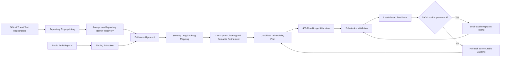
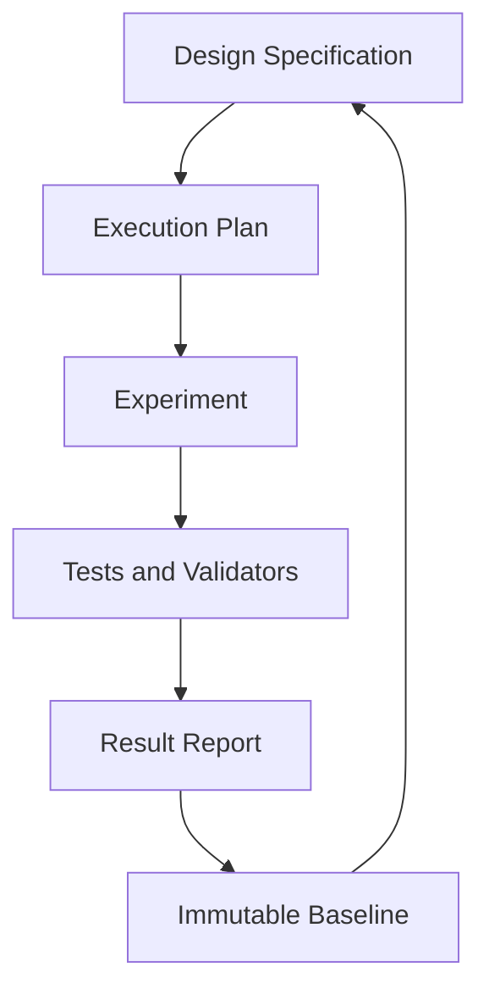

<div align="center">

# 🐈‍⬛ OneSavie Bastet
## Evidence-Driven Vulnerability Prediction

**面向大规模智能合约代码仓库的证据驱动漏洞预测与代理协作优化框架**

[](#)
[](#)
[](#)
[](#)
[](#)

<br>

> 从匿名仓库识别、公开审计证据迁移，到固定行预算优化与语义标签精修。  
> 本项目探索如何将一次性的模型预测，转化为**可验证、可回退、可追溯**的长期安全分析流程。

[项目概览](#-项目概览) ·
[核心方法](#-核心方法) ·
[实验结果](#-实验结果) ·
[快速开始](#-快速开始) ·
[论文与引用](#-论文与引用)

</div>

---

## 📌 项目概览

本仓库记录了 OneSavie Bastet 智能合约漏洞预测任务中的完整优化过程。

与常规的单标签分类任务不同，该任务需要针对匿名代码仓库输出一个由多条漏洞记录组成的结构化集合。每条预测同时包含：

- `repo_path`
- `severity`
- `tag`
- `subtag`
- `description`
- 其他提交所需字段

提交文件还受到固定 **400 行** 的全局约束，而评分同时考虑标签、严重程度、描述语义相似度、集合匹配关系和过度预测惩罚。

因此，本项目没有将问题简单处理为“训练一个更大的模型”，而是将其重构为：

> **隐藏仓库身份恢复 + 漏洞证据迁移 + 固定预算分配 + 语义对齐 + 风险控制**

---

## ✨ 项目亮点

| 模块 | 核心思想 | 作用 |
|---|---|---|
| 🔎 仓库身份恢复 | 对文件路径、源码、配置和 Git 元数据构建内容指纹 | 突破匿名 `repo_path` 的信息瓶颈 |
| 🧩 漏洞证据迁移 | 对齐公开审计 finding、比赛标签空间与代码版本 | 将外部知识转化为可评分预测 |
| 📊 400 行预算优化 | 把每一条预测视为有限资源 | 平衡召回率、精确率与过度预测风险 |
| 📝 描述语义修复 | 去除模板化描述，补充根因、触发条件和影响 | 提升描述嵌入相似度 |
| 🏷️ Exact-title 标签精修 | 冻结稳定结构，只修改强证据支持的标签 | 在低风险下完成后期增益 |
| 🧠 代理协作工作流 | 通过规格、计划、报告、测试和验证门外部化上下文 | 支撑超出单一上下文窗口的长期实验 |

---

## 🎯 任务特点

该任务并不是“一行样本对应一个标签”的普通分类问题，而是一个带全局资源约束的仓库级结构化预测问题。

### 主要困难

1. **仓库身份匿名化**：CSV 中的 `repo_path` 缺乏业务语义，无法直接判断项目类型和漏洞背景。
2. **输出是漏洞集合**：单个仓库可能对应零条、一条或多条漏洞，预测之间不能完全独立处理。
3. **字段具有联合依赖**：`severity`、`tag`、`subtag` 和 `description` 共同影响最终匹配质量。
4. **提交预算固定**：全局必须生成 400 行，但单仓库过度预测可能受到惩罚。
5. **外部证据存在版本漂移**：历史审计报告中的漏洞未必仍存在于比赛使用的代码快照中。

---

## 🧠 核心方法



### 1. 仓库指纹恢复

针对官方代码包中的每个仓库提取多层特征：

- 文件路径和目录结构；
- Solidity 源文件内容聚合哈希；
- 其他源码文件内容聚合哈希；
- `package.json`、Foundry、Hardhat 等配置；
- 依赖和项目 manifest；
- `.git/config`、`.git/index` 与 `.git/packed-refs`。

通过这些指纹与公开项目进行比对，将匿名仓库恢复为真实项目或项目家族。

### 2. 公开漏洞证据迁移

身份恢复后，将公开审计材料转化为比赛允许的结构化字段：

```text
Public Finding
    ↓
Repository Alignment
    ↓
Version / Source Verification
    ↓
Severity Mapping
    ↓
Tag & Subtag Mapping
    ↓
Description Cleaning
    ↓
Validated Candidate
```

迁移过程遵循以下证据优先级：

| 证据等级 | 示例 | 使用策略 |
|---|---|---|
| Very High | 源码和文件指纹完全匹配 | 可优先迁移 |
| High | Git origin、项目 slug、目录结构高度一致 | 经字段校验后使用 |
| Medium | 同项目家族、不同时间版本 | 需要源码条件验证 |
| Low | 仅文件名、函数名或依赖相似 | 不直接作为漏洞结论 |

### 3. 固定行预算分配

400 行并不是简单的格式要求，而是全局预测预算。

对于候选漏洞 \(v_i\)，可以将其选择价值概念化为：

\[
U(v_i)=P_i(\text{match})\cdot S_i-C_i(\text{over-prediction})-R_i(\text{version drift})
\]

其中：

- \(P_i(\text{match})\)：候选与真实漏洞匹配的置信度；
- \(S_i\)：匹配成功后的预期结构化得分；
- \(C_i\)：单仓库过度预测带来的潜在代价；
- \(R_i\)：外部证据与当前代码版本不一致的风险。

后期优化不再追求“生成更多候选”，而是比较：

> 新加入的一行，是否比被替换的一行具有更高的预期收益？

### 4. 描述语义对齐

描述字段不是附属文本，而是评分函数的一部分。高质量描述应尽量包含：

- 漏洞核心行为；
- 触发条件；
- 关键函数或合约；
- 根本原因；
- 资产、权限或状态影响。

本项目逐步移除泛化模板、链接、提交者信息、修复建议和无关代码块，使描述更接近真实漏洞报告的语义表达。

### 5. Exact-title 标签精修

当仓库分配、漏洞数量、严重程度和描述已经稳定后，系统冻结强结构，只对存在明确标题证据的 `tag` 和 `subtag` 进行局部修正。

该阶段遵循：

- 不改变总行数；
- 不改变仓库分配；
- 不改变描述；
- 不改变严重程度；
- 仅修改有唯一、明确标题证据支持的标签字段。

---

## 🤖 代理协作与外部化上下文

项目使用分阶段代理协作思想管理长周期实验。

单一代理难以在一个上下文窗口中同时容纳大量代码、候选 CSV、审计材料、实验报告和失败历史。为此，项目将上下文外部化到文件系统中：



### 工作流组成

- **Specifications**：记录目标、约束、风险和成功标准；
- **Plans**：将复杂方向拆分为可执行步骤；
- **Reports**：保存输入、输出、分数变化和失败原因；
- **Tests**：保护字段、行数、标签空间和差异范围；
- **Immutable Baselines**：保留排行榜验证过的稳定版本；
- **Diff-based Review**：确保后期实验的变化可归因。

这种设计使代理不必“记住整个项目”，而是通过读取对应文档恢复状态，完成跨阶段协作。

---

## 📈 实验结果

> 以下分数为项目资料中记录的公开榜阶段性结果，不代表官方最终排名，也不保证私榜表现。

| 阶段 | 核心策略 | 公开榜分数 |
|---|---|---:|
| Initial Baseline | 匿名路径、标签频率与通用模板 | ≈ 45–46 |
| Repository Matching | 35 个高置信仓库映射与漏洞迁移 | ≈ 233 |
| Coverage Expansion | 扩展仓库识别和项目家族映射 | ≈ 373 |
| Full Repository Coverage | 公开报告与源码检查补齐 | ≈ 375.8 |
| Budget Rebalancing | 从低价值行转移至覆盖不足仓库 | 381.8 |
| Targeted Replacement | 12 对 12 同预算替换 | 382.5 |
| Semantic Description Repair | 清除模板描述并强化根因表达 | 400.75 |
| Exact-title Refinement | 冻结结构，仅精修标签 | ≈ 402.6 |
| Failed Full Replacement | 全量替换稳定基线 | 227 |

### 分数演化

```text
45–46
  │  Anonymous paths provide little repository-specific information
  ▼
233
  │  Repository identities recovered through fingerprints
  ▼
373 → 375.8
  │  Coverage expanded to more test repositories
  ▼
381.8 → 382.5
  │  Fixed-budget replacement and allocation
  ▼
400.75
  │  Description semantic alignment
  ▼
402+
     Exact-title tag/subtag refinement
```

### 关键观察

- 最大的早期增益来自**恢复仓库身份**，而不是调整模型规模；
- 覆盖基本完成后，主要矛盾转向**行预算分配**；
- 结构稳定后，描述质量成为重要增益来源；
- 高分阶段的大范围替换风险远高于小范围、可回退修改；
- 公开榜反馈只能作为实验信号，不能替代代码与审计证据。

---

## 🗂️ 推荐仓库结构

> 上传代码后，可根据你的真实文件名调整本节。

```text
.
├── README.md
├── LICENSE
├── requirements.txt
│
├── data/
│   ├── README.md
│   ├── raw/                    # 不提交受限或比赛原始数据
│   ├── processed/              # 本地生成的中间数据
│   └── mappings/               # 仓库与标签映射
│
├── src/
│   ├── fingerprint/            # 仓库指纹提取与匹配
│   ├── findings/               # 审计 finding 抽取与清洗
│   ├── mapping/                # severity / tag / subtag 映射
│   ├── allocation/             # 400 行预算分配
│   ├── refinement/             # 描述与标签精修
│   └── validation/             # CSV 与差异验证
│
├── scripts/
│   ├── build_fingerprints.py
│   ├── match_repositories.py
│   ├── transfer_findings.py
│   ├── build_submission.py
│   └── validate_submission.py
│
├── outputs/
│   ├── submissions/            # 候选提交文件
│   └── reports/                # 实验与误差分析报告
│
├── docs/
│   ├── specs/                  # 设计规格
│   ├── plans/                  # 执行计划
│   └── figures/                # 论文与 README 图片
│
├── tests/
│   └── ...
│
└── paper/
    └── OneSavie_Bastet_course_paper.pdf
```

---

## 🚀 快速开始

### 1. 克隆仓库

```bash
git clone https://github.com/<your-username>/<your-repository>.git
cd <your-repository>
```

### 2. 创建 Python 环境

```bash
python -m venv .venv
```

Windows：

```bash
.venv\Scripts\activate
```

macOS / Linux：

```bash
source .venv/bin/activate
```

### 3. 安装依赖

```bash
pip install -r requirements.txt
```

### 4. 准备数据

比赛原始数据、第三方审计材料和受许可证限制的仓库不应直接重新分发。请将合法获取的数据放入：

```text
data/raw/
```

并在 `data/README.md` 中记录数据来源、获取方式、许可证或使用限制、预期目录结构和文件完整性校验信息。

### 5. 运行流水线

以下命令为推荐调用方式，请根据实际脚本参数调整：

```bash
python scripts/build_fingerprints.py \
  --input data/raw/test \
  --output data/processed/fingerprints.json
```

```bash
python scripts/match_repositories.py \
  --fingerprints data/processed/fingerprints.json \
  --output data/mappings/repository_mapping.csv
```

```bash
python scripts/transfer_findings.py \
  --mapping data/mappings/repository_mapping.csv \
  --output data/processed/candidates.csv
```

```bash
python scripts/build_submission.py \
  --candidates data/processed/candidates.csv \
  --output outputs/submissions/submission.csv
```

```bash
python scripts/validate_submission.py \
  --submission outputs/submissions/submission.csv
```

---

## ✅ 提交验证

在生成最终 CSV 前，建议至少检查以下不变量：

- [ ] 总行数为 400；
- [ ] 所有必需字段存在；
- [ ] `repo_path` 属于测试仓库集合；
- [ ] `severity`、`tag`、`subtag` 位于允许空间；
- [ ] 关键字段不存在非法空值；
- [ ] 仓库覆盖情况符合当前策略；
- [ ] 与稳定基线的差异范围符合实验设计；
- [ ] 没有意外覆盖已有高分文件；
- [ ] 输出文件已记录哈希和生成参数。

示例：

```bash
sha256sum outputs/submissions/submission.csv
```

---

## 🧪 实验原则

### Immutable Baseline

任何排行榜验证过的高分 CSV 都应作为不可变基线保存。新实验必须输出到新文件，禁止直接覆盖。

### Small, Reversible, Attributable

后期修改应满足：

1. **Small**：变化范围足够小；
2. **Reversible**：能够快速回退；
3. **Attributable**：分数变化能够归因到具体策略。

### Evidence before Prediction

公开报告、函数名称或文件存在本身并不等价于漏洞存在。高风险候选必须尽可能经过源码条件、版本信息或唯一标题证据验证。

---

## ⚠️ 局限性

- 公开榜成绩不等同于私榜泛化能力；
- 外部报告与比赛代码之间可能存在版本漂移；
- 同项目家族映射仍可能产生误判；
- 外部标签体系与比赛标签空间并不完全一致；
- 固定 400 条非空预测可能增加过度预测风险；
- 多次排行榜试验可能导致对公开榜过拟合；
- 代理协作工具只能组织流程，不能替代人工判断、测试和安全验证。

---

## 🔐 安全、伦理与数据声明

本项目仅用于智能合约安全研究、防御性漏洞分析、课程学习、方法复现，以及结构化预测和代理协作研究。

请勿将本仓库用于未经授权的系统测试、真实资产攻击、漏洞利用自动化、绕过访问控制，或侵犯第三方数据、代码与审计报告版权。

仓库不会主动分发比赛受限数据、私有代码、访问凭证或未经许可的第三方材料。使用者应自行确认数据来源、许可证和竞赛规则。

---

## 📄 论文与引用

课程论文主题：

> **面向大规模代码仓库漏洞预测的证据驱动优化与代理协作方法研究——以 OneSavie Bastet CSV 提交优化为例**

论文文件计划存放于：

```text
paper/OneSavie_Bastet_course_paper.pdf
```

若本项目对你的研究或课程作业有帮助，可使用以下占位引用：

```bibtex
@misc{xu2026bastet,
  title  = {Evidence-Driven Optimization and Agent Collaboration for Large-Scale Repository Vulnerability Prediction},
  author = {Zeda Xu},
  year   = {2026},
  note   = {Course project for Artificial Intelligence Security and Ethics},
  url    = {https://github.com/<your-username>/<your-repository>}
}
```

---

## 🛣️ 后续计划

- [ ] 整理并公开可复现的 Python 流水线；
- [ ] 补充每个模块的命令行参数说明；
- [ ] 增加候选漏洞置信度评分；
- [ ] 增加版本漂移检测；
- [ ] 为标签映射和提交验证补充单元测试；
- [ ] 上传课程论文 PDF；
- [ ] 补充完整实验日志和消融分析；
- [ ] 添加中英文双语文档。

---

## 🙏 致谢

感谢 OneSavie Bastet 任务提供的智能合约安全研究场景，以及公开审计社区提供的安全知识和研究材料。

本项目同时感谢在实验过程中用于任务拆解、代码分析、文档组织和结果复盘的代理协作工具。所有关键结论均应以源码证据、验证脚本和实验记录为依据。

---

<div align="center">

### Evidence first. Small changes. Reproducible results.

**以证据约束预测，以验证保护基线，以协作延伸上下文。**

</div>
